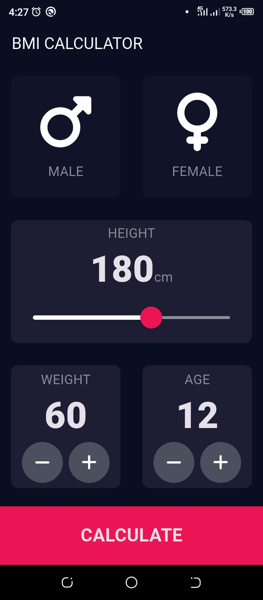

# BMI CALCULATOR

  

## Overview

The aim of this project is to learn the basics of flutter which include; widgets, theming, variables, enum, page navigation, passing data from one page to another etc.

## How to Install and Test the Application

You can clone this project on your local machine. To do that, you must have git installed on your local machine.
**Flutter and Dart** must be installed. Click [here](https://flutter.dev) to download.

1. Open your terminal and navigate to your desired directory
2. Run this command `git clone https://github.com/kenbuzor/bmi_calculator.git` this will create a directory called bmi_calculator which houses all the files and folders of the project, it is the project root.
3. Navigate to the cloned project `cd bmi_calculator/`
4. Open the project on vscode with this command `code .` Note, you can use any code editor of your choice.
5. On your terminal, in the root of your project, run this command to install all necessary dependencies if any `flutter pub get`
   **Note:** _You must have flutter and dart installed on your local machine_
6. You can now read and modify code to suit your need and test the app on an emulator/simulator or on a real device.

### Reference Links

- [Flutter Official Documentation](https://docs.flutter.dev/)

Happy Coding </>
